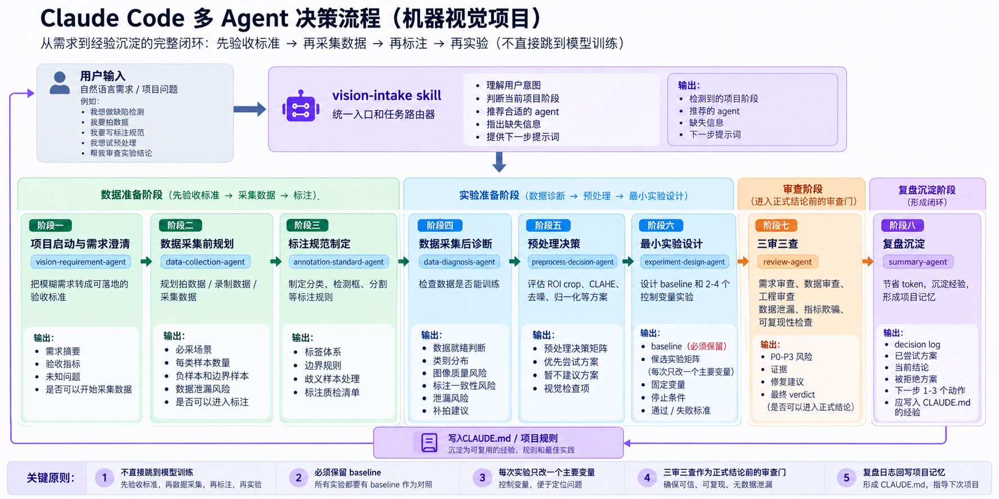

# Claude Code 多子 Agent 工作流

一套可安装、可审计、可回退的 Claude Code 多 Agent 审查工作流。它不让所有 Agent 无条件出场，而是按任务风险选择角色，用结构化交接减少方向错误、隐性假设和范围失控。

## 可视化：机器视觉项目中的多 Agent 决策流程



这张图展示本方法在机器视觉项目中的领域化设计：从需求澄清、采集与标注，到数据诊断、预处理、最小实验、三审三查和复盘沉淀。核心思想是先定义验收标准，再采集和诊断数据，最后进入实验，避免直接跳到模型训练。

> 当前图片是领域工作流的概念设计示例。本仓库当前可安装的实现是下方六角色通用审查框架；图中的 `vision-requirement-agent` 等领域 Agent 尚未作为可安装组件发布。

## 为什么做这个项目

单 Agent 很容易在同一条思路里同时完成“提出方案、实现、证明自己正确”。本项目把互相冲突的职责拆开：

| 角色 | 负责回答 | 典型时机 |
|---|---|---|
| `premise-overturner` | 方向值得做吗，有没有更小路线？ | 实现前 |
| `assumption-challenger` | 方案默认了哪些“应该没问题”？ | 实现前、最终复审 |
| `test-designer` | 用什么最小证据证明做对了？ | 复杂任务实现前 |
| `metric-gate` | “更好”是否有基线和数据？ | 性能/质量任务验证后 |
| `rollback-planner` | 改坏后怎样恢复？ | 高风险变更前 |
| `range-creep-guardian` | 最终改动是否超出需求？ | 实现后 |

## 工作流

```text
需求四要素
   │
   ├─ 前提审查 ── stop / 缩小方案 / 继续
   │
   ├─ 假设审查 ── 风险、缓解、验证
   │
   ├─ [按风险选择] 测试设计 / 指标守门 / 回滚规划
   │
   ├─ 实现与独立验证
   │
   └─ 范围审查 + 最终假设复审 + 交付报告
```

默认的三审查模式只启用前提、假设和范围角色。算法、性能和高风险变更才增加其他角色，避免为了“多 Agent”而增加无意义的耗时和 Token。

## 仓库结构

```text
agents/                  六个 Claude Code 子 Agent 定义
skills/three-review/     日常三审查编排 Skill
skills/six-role-drill/   六角色只读回归演练 Skill
docs/                    架构、交接协议、安全和评测方法
examples/                最小任务输入与示例输出
evals/cases.json         20 个固定评测任务
scripts/                 安装、卸载和静态校验脚本
```

## 快速开始

要求：已安装 Claude Code；安装脚本只写入当前用户的 `~/.claude/agents` 与 `~/.claude/skills`。

Windows PowerShell：

```powershell
./scripts/install.ps1
```

macOS / Linux：

```bash
bash ./scripts/install.sh
```

安装后在 Claude Code 中输入：

```text
/three-review

我现在的问题：导出接口在空数据时返回 500。
我希望得到的结果：空数据时返回只有表头的 CSV。
这次不要做：不改数据库，不重构其他导出逻辑。
完成标准：自动测试覆盖有数据、空数据和非法筛选条件。
```

卸载仅删除本项目安装的同名文件，不删除整个 `.claude` 目录：

```powershell
./scripts/uninstall.ps1
```

## 验证

静态验证用于检查仓库结构、Agent frontmatter、固定输出键、评测集数量和敏感信息模式：

```bash
npm test
```

主行为评测由 Mimo 按 [`MIMO.md`](./MIMO.md) 执行。仓库当前不会把“文件存在”冒充成“多 Agent 质量已提升”；真实对照结果应写入 `evals/results/` 后再更新本 README。

## 设计边界

- Agent 输出是审查意见，不是事实来源；仍需测试或人工审批。
- 网页、文档、终端输出均按不可信数据处理。
- 默认最小权限；推送、删除、生产变更和外部发送保留人工确认。
- Trace 只保留任务输入、角色判定和可公开证据，不保存隐藏推理、凭据或本机绝对路径。
- 不保证所有 Claude Code 版本、模型或兼容端点都支持子 Agent；失败时允许清晰标记的主 Agent 模拟，但不能伪装成真实 spawn。

## 状态

当前版本：`v0.2.0`（公开候选版）。结构和静态规则已整理；主评测尚待 Mimo 执行，因此暂不发布质量提升百分比。

## License

[MIT](./LICENSE)
